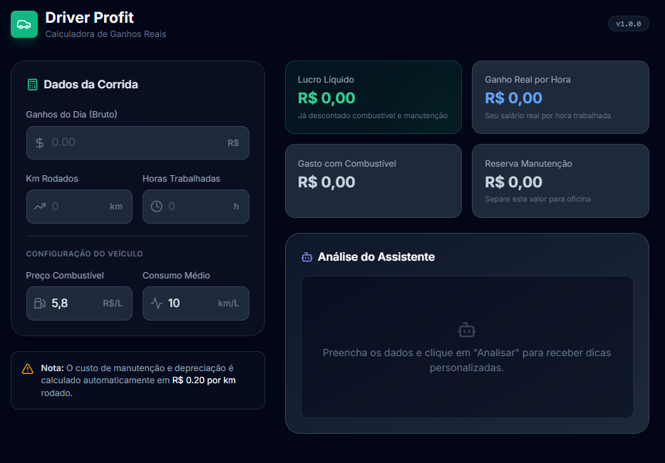

# Driver Profit: AI Financial Advisor for Gig Workers
> *Built for the Google DeepMind "Vibe Code with Gemini 3 Pro" Hackathon*

 
*(Replace the link above with the screenshot you showed me)*

## 📖 Overview
**Driver Profit** is a web application designed to bring financial transparency to the "Uberization" economy in Brazil. Many gig workers focus solely on gross revenue, ignoring hidden costs like vehicle depreciation, maintenance, and long-term risks.

Powered by **Gemini 3 Pro**, this tool calculates the *true* net hourly wage of a driver and acts as a personalized financial advisor, offering actionable tips on cost-saving and investments (like LCA) based on their real profit margins.

🔗 **[Live Demo App](SEU_LINK_DO_AI_STUDIO_AQUI)** 🎥 **[Video Demonstration](SEU_LINK_DO_YOUTUBE_AQUI)**

---

## The Problem
In the Global South (specifically Brazil), the gig economy is a primary source of income for millions. However, low financial literacy regarding **OPEX (Operational Expenditure)** often leads drivers to overestimate their earnings.
* **Gross Income:** Easy to see.
* **Net Income:** Hard to calculate (involves fuel, R$0.20/km maintenance, taxes, etc.).

## The Solution
We used **Google AI Studio's "Vibe Coding"** to build a reactive calculator that:
1.  **Inputs:** Takes daily metrics (Earnings, Km driven, Gas price).
2.  **Processing:** Automatically deducts fuel and a statistical maintenance reserve.
3.  **AI Reasoning:** Sends the financial snapshot to **Gemini 3 Pro**, which analyzes the data contextually.
    * *If profit is low:* Suggests immediate optimization tactics.
    * *If profit is high:* Suggests financial products (e.g., LCA, Savings) to protect wealth.

## Tech Stack & Methodology
* **Engine:** Google AI Studio (Build Tab).
* **Model:** Gemini 3 Pro (Experimental).
* **Method:** Vibe Coding (Natural Language Programming).
* **Key Capability Used:** Advanced Reasoning & Multimodality (generating dual-language financial advice).

## 🇧🇷 Why is the Interface in Portuguese?
This project prioritizes **Social Impact** and **Accessibility**.
The target audience is Brazilian drivers in the state of Rio Grande do Norte (and nationwide). To ensure real-world adoption and usability, the UI is natively in Portuguese.
* *Note for Judges:* The AI Assistant output has been engineered to provide an **English Summary** below the Portuguese advice for auditing purposes.

## Screenshots
| Input Data | AI Analysis |
|:---:|:---:|
|  |  |

## License
This project is licensed under the **CC BY 4.0** - Open Source.

---
*Created by Jasdson Chagas - 2025*
